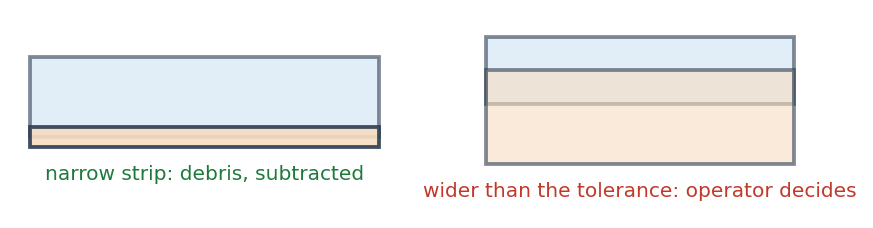
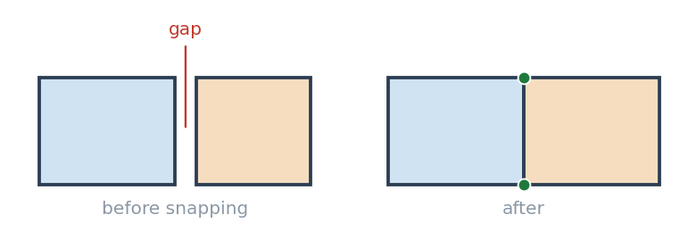
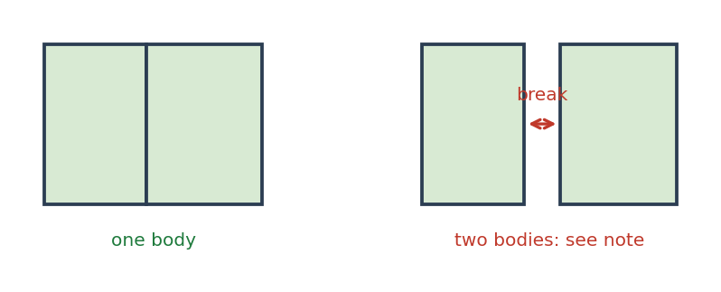
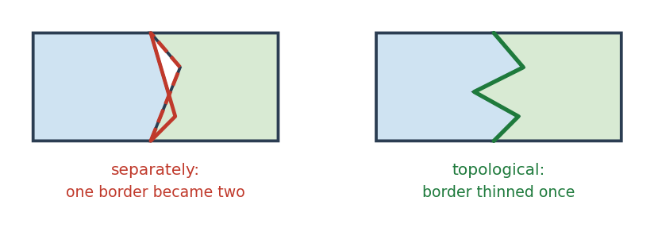

# Topoliner. Short manual

[Русская версия](MANUAL.md)

Version 0.6.0

The plugin adds a **Topoliner** group with six tools to the Processing panel.
Its purpose is to bring a polygon coverage into order without the manual
routine of snapping a layer to itself.

---

## 1. Installation

**Plugins - Manage and Install Plugins - Install from ZIP**, choose
`topoliner.zip`. Restarting QGIS is not required.

The tools appear in the **Processing** panel, group **Topoliner**.

---

## 1a. Interface language

The plugin is bilingual. The language is taken from the QGIS locale, not from
the system one: if QGIS is set to English, the plugin interface is English too.
Names, parameters, help texts, reports and violation names are all translated.

---

## 2. Tools

The tool number sets both the group and the order in the Processing panel:
group **1. Topology** holds 1.01 to 1.06, group **2. Generalisation** holds 2.01.
The order within the first group follows the workflow: check, clean, snap
separately if needed, verify the assembly.

| Tool | What it does | Modifies the layer |
|---|---|---|
| **1.01 Polygon topology check** | Finds violations, produces a point layer and a summary | No |
| **1.02 Line topology check** | Undershoots, overshoots, dangles, pseudo nodes | No |
| **1.03 Polygon topology cleanup** | Fixes everything that is debris | Yes, into a new layer |
| **1.04 Line topology cleanup** | Trims overshoots, closes undershoots, inserts nodes | Yes, into a new layer |
| **1.05 Node and vertex snapping** | Only reconciles nodes and vertices | Yes, into a new layer |
| **1.06 Insertion of missing nodes** | Adds nodes without changing shape or area | Yes, into a new layer |
| **1.07 Assembly check by attribute** | Checks whether groups assemble into one body. Polygons and lines | No |
| **2.01 Topology-preserving simplify** | Thins vertices of polygons and lines without tearing shared borders | Yes, into a new layer |
| **2.02 Polygon borders as lines** | Outputs borders as separate lines, each one once | No |

All tools work in models and in batch mode. The input layer is never modified;
the result always goes to a new layer.

---

## 3. Quick start

### A polygon coverage

Four steps, in this order.

**Step 1. Check.** Run **1.01 Polygon topology check** with a tolerance of 2 and
an area threshold of 1. Read the summary in the Processing panel. It answers
the main question: how much will be fixed silently and how much has to be
looked at by hand.

**Step 2. Clean.** Run **1.03 Polygon topology cleanup** with the same
thresholds. Read the report, especially the line about the area.

**Step 3. Check again.** Repeat step 1 over the result. The **auto** column
should be empty. Whatever remains under **review** is sorted out by hand.

**Step 4. Check the assembly.** Run **1.07 Assembly check by attribute** on the
block field, then on the panel field. This is the acceptance criterion.

### A line layer

**Step 1.** **1.02 Line topology check** with a tolerance of 2. See how many
undershoots and overshoots there are against dangles: the first two are fixed,
the third is left to you.

**Step 2.** **1.04 Line topology cleanup** with the same tolerance.

**Step 3.** Repeat step 1. Only dangles should remain.

**Step 4.** If needed, **1.07 Assembly check by attribute**: does a group of
lines assemble into one connected chain.

---

## 4. Two thresholds

All behaviour is set by two numbers.

**Tolerance**, in layer CRS units. The maximum vertex displacement and the
search radius for neighbouring edges. Take it slightly above the real size
of the discrepancies and well below the width of the narrowest object.
For borders digitised from plans this is usually 1 to 2 metres.

**The main rule for the tolerance: it must be smaller than the width of the
narrowest object.** An object narrower than the tolerance has its opposite
banks stick together and collapses into itself. Tool 1.05 prints the minimum
and median ring width before the computation and reports how many rings are
narrower than the tolerance. Such rings are left untouched by default and
serve as anchors for their neighbours.

**Area threshold**, in square CRS units. The area below which a fragment is
treated as technical debris. A reasonable starting point is the tolerance
squared: with a tolerance of 2 metres that is 4 square metres, though 1 is
often enough in practice.

**Overlaps are judged by width, not by area.** A strip as wide as the tolerance
and tens of metres long collects a hundred square units while still being
a consequence of vertex movement. Debris is an overlap narrower than the
tolerance; a wider one is a dispute over real area.

If in doubt, start small: underestimating a threshold is safe, overestimating
is not.

---

## 5. Tool 1.01 Polygon topology check


**Input.** A polygon layer. Selected features only is supported.

**Output.** A point layer with the fields `type`, `label`, `severity`,
`fid_a`, `fid_b`, `value`, `note` and `grp`.

**How to read it.** Style the layer by `severity`. The `review` points are
the working list; the `auto` points do not need looking at, the cleanup tool
will remove them.

**Two similar violations are worth telling apart.** *A vertex lies on
a neighbour edge* means a distance of zero: the borders coincide geometrically
but the neighbours have different vertices. That is a defect under any
tolerance. *A vertex near an edge* means mere proximity, and the count is set
entirely by the tolerance. If the median in the summary is close to the
tolerance rather than to zero, you are looking at neighbouring objects,
not at defects.

**The grouping field** is needed when the layer is not a single coverage,
for example when zones of several seams share one layer. Such objects overlap
by design, and without grouping every overlap lands in the findings. On a real
zone layer of 379 objects a whole-layer check produced 166 findings, while
grouping by seam gave 41.

**The cavity area threshold** separates a pillar, a lake or an unmapped area
from a coverage defect: a small hole is an error, a very large one is almost
always part of the design.

---

## 6. Tool 1.02 Line topology check


The layer is not modified. The output is a point layer with the findings
and a summary in the Processing panel.

Lines have their own set of violations. Gaps, overlaps, nested objects
and slivers do not apply to them, while undershoots, overshoots, dangles
and pseudo nodes appear.

**Three cases at a line end are worth telling apart.** An *undershoot* is an
end that did not reach a neighbouring line: the distance is below the
tolerance, a digitising trace. An *overshoot* is a tail sticking out past
an intersection, also a digitising trace. A *dangle* is an end with nothing
to connect to: in a stream network or a set of mine workings it is usually
an outlet or a dead end, so the decision is left to the operator.

The order of checks matters: the end of a tail past a node is also away from
the neighbouring line, so overshoots are looked for before undershoots.

**A pseudo node** is a joint of two lines end to end with nothing else there.
The check is off by default: in many layers the splitting into segments
is deliberate.

---

## 7. Tool 1.03 Polygon topology cleanup




**Fixed silently**: repeated vertices, spikes, vertices lying on a neighbour
edge without a node, edge crossings without shared vertices, discrepancies
below the tolerance, tiny holes and tiny parts, invalid geometry, narrow
overlaps, small gaps.

**Never done**: wide overlaps, large gaps, duplicates, nested objects, sliver
polygons, deletion of tiny objects without explicit permission. All of this
goes to the **Remaining problems** layer with an explanation in `note`.

**Order of steps.** Vertex artefacts, then tiny parts and holes, then snapping,
then repair of invalid geometry, then overlaps, then gaps. The order is fixed:
spikes must go before snapping, otherwise they turn into false nodes and get
spread across neighbours; validity repair must come after snapping, because
snapping can itself produce a self-intersection.

**Guarantees.** No vertex moves further than the tolerance. An edit taking more
than a quarter of an object's area is cancelled and the object is restored.
A repeat run changes nothing. Attributes are preserved.

The output layer is always of multi type: a repair may split an object.

---

## 8. Tool 1.04 Line topology cleanup

Fixes what is certainly a digitising trace.

Removes repeated vertices and spikes, trims overshoots back to the
intersection point itself, closes undershoots onto their projection on the
neighbouring line, inserts missing nodes, removes zero-length lines.

**What is not done**: dangles are not touched, lines shorter than the
threshold are not deleted without explicit permission, pseudo nodes are not
merged.

**Guarantee.** A line end does not move further than the tolerance. A repeat
run over the result changes nothing.

---

## 9. Tool 1.05 Node and vertex snapping




Use it when the coverage is otherwise fine and only the borders need
reconciling. It does not touch overlaps or gaps.

A useful habit: run it first in **Insert nodes only** mode. It does not move
a single existing coordinate and shows the real amount of discrepancy through
the number of inserted nodes.

**The reference layer** is a separate parameter. Its vertices are treated as
fixed and attract the input layer; the reference itself is not modified and
does not appear in the result. Use it when a new area is stitched to a border
that has already been accepted.

---

## 10. Tool 1.06 Insertion of missing nodes

Adds nodes where a vertex of one object lies on the edge of another. Nothing
else.

**How it differs from snapping.** Snapping moves vertices to close
discrepancies. Here there is no discrepancy at all: the borders already
coincide, only the vertices differ. Insertion therefore moves nothing, and
the total area stays exactly the same.

**When it is needed.** Different vertices do not affect rendering and are
invisible to the eye, but they break dissolve by attribute, overlays,
generalisation and loading into a database with strict topology. A typical
source is independent construction of polygons on either side of a shared
straight line, such as a fault line or the edge of a clipping mask.

**Several passes may be required**: an inserted node sometimes lands on the
edge of a third object. The tool repeats passes while nodes are still found.

**The deviation from the edge** is not a tolerance. The distance here is zero,
and the number only acts as a safeguard. The default matches coordinate
precision; setting metres is wrong.

---

## 11. Tool 1.07 Assembly check by attribute




Checks that the union of objects sharing an attribute value gives exactly one
part without interior rings. The layer is not modified.

**What is found.** *The group split into parts* means a break remains inside
the group; the `note` field holds the distance to the nearest part, which is
exactly the tolerance that was missing. *An interior ring within a group* means
a hole remains inside.

**An important property.** The check finds what a coverage-wide gap search
cannot: a gap reaching the outer edge is not a hole in the union, yet it cuts
the group in two during assembly.

**When a group need not be whole.** One attribute value often describes several
separated bodies: contour polygons of one level, islands, areas of one type.
Set the **maximum gap** for such data. The sign that it is needed shows at once:
if `note` holds hundreds of metres, these are not assembly defects.

---

## 12. Tool 2.01 Topology-preserving simplify




Thins vertices so that a border shared by two neighbours stays shared.

**Why.** Ordinary simplification processes each polygon separately, so the same
border is thinned twice and differently, producing gaps and overlaps.
Measured on a zone layer with a tolerance of 5: the topological version
produces no violations at all, the independent one produces 46 overlaps,
25 gaps and 189 mismatched nodes.

**Smoothing** cuts corners after thinning, over the same arcs, so a shared
border stays shared. Chaikin's scheme does not leave the original line, so no
overshoots and no new self-intersections appear. Each pass roughly doubles the
vertex count.

**How it works.** Shared edges are glued into arcs between branch nodes, each
arc is thinned exactly once, and both neighbours receive the same result.
Arc ends are fixed, so the nodes where three polygons meet do not move.

The area changes during simplification, that is its purpose. Topology is not
damaged: check the result with 1.01, the number of findings must not grow.

---

## 13. What is handled on shared borders

| Case | Result |
|---|---|
| A neighbour has a vertex on the shared border, we do not | A node is inserted, coordinates do not move |
| A T-junction of three polygons | The node appears where it was missing |
| Four polygons meeting at a corner within the tolerance | All corners merge into one point |
| A corner overshooting into a neighbour by less than the tolerance | Vertices merge, the overshoot disappears |
| Edges crossing without shared vertices | Nodes are placed at the intersections |
| A slanted border that already matches | Nothing changes, no false nodes |
| A mismatch larger than the tolerance | Left alone, this is a meaningful case |

---

## 14. Z values

When snapping, a vertex takes the plan coordinates of the leader and keeps its
own elevation, so seams with different Z do not get mixed.

In the cleanup tool the intersection operations work in plan, so Z is restored
from the nearest original vertex. For coverages this is correct; for layers
with sharp elevation changes along a border the result should be checked.

---

## 15. Warnings in the report

**The total area changed by more than one per cent.** Almost always means the
area threshold is too high.

**Degenerate rings removed.** The tolerance exceeds the size of the objects
themselves.

**Objects disappeared.** An object was lost entirely during repair. Find it
in the remaining problems layer by the `lost` type.

**Repairs cancelled due to area loss.** The safeguard worked: repairing invalid
geometry would have taken more than a quarter of the area, so the object was
left unchanged.

**Objects with ring self-touches.** GEOS considers such geometry valid while
SQL Server may reject it. Apply `MakeValid` on the server side when loading.

---

## 16. Limitations

**Gaps are found as holes in the union of the coverage.** A gap reaching the
outer edge is not a hole and is not found this way. Such gaps are closed by
vertex snapping when their width is below the tolerance.

**The layer is read into memory in full.** For layers of hundreds of thousands
of objects, process them in parts.

**Lines have their own group 3**: check and cleanup. Lines are also accepted
by 1.05 snapping, 1.06 node insertion, 2.01 simplification and 1.07 assembly
check.

**Automation cannot know which of two disputed borders is correct.** It only
tells scale: a centimetre overlap is an error, a hectare one is a disagreement
between sources. Wide overlaps and large gaps therefore always stay with
the operator.

---

## 17. Parameter reference

Tables for quick lookup: what a field in the dialog means and what it changes.
The reasoning behind each choice stays in the tool sections; this is a summary.

The mark **optional** means the parameter may be left empty.

### 1.01 Polygon topology check

| Parameter | Default | What it sets |
|---|---|---|
| Layer to check (polygons) | - | The layer is not modified |
| Tolerance (in layer CRS units) | 2 | The distance below which a discrepancy counts as a digitising error |
| Debris area threshold (square CRS units) | 1 | The area below which a fragment counts as technical debris |
| Grouping field or fields, *optional* | - | Violations are searched within each group separately. Needed when a layer holds several coverages |
| Cavity larger than this area is not counted as a gap | 0 | A pillar, a lake, an unmapped area. Zero switches it off |
| Find overlaps, duplicates and nested objects | yes | |
| Find gaps in the coverage | yes | |
| Find vertices without a node on a neighbour edge | yes | |
| Findings | - | Output point layer |

### 1.02 Line topology check

| Parameter | Default | What it sets |
|---|---|---|
| Layer to check (lines) | - | The layer is not modified |
| Tolerance (in layer CRS units) | 2 | Undershoots and overshoots below the tolerance count as debris |
| Line length threshold | 0 | Shorter lines land in the findings. Zero switches it off |
| Find dangles, undershoots and overshoots | yes | |
| Find crossings without a node | yes | |
| Find pseudo nodes | no | Off on purpose: in many layers the splitting into segments is deliberate |
| Findings | - | Output point layer |

### 1.03 Polygon topology cleanup

| Parameter | Default | What it sets |
|---|---|---|
| Input layer (polygons) | - | |
| Tolerance (in layer CRS units) | 2 | The maximum vertex displacement |
| Debris area threshold (square CRS units) | 1 | The line between debris and possible meaning |
| Grouping field or fields, *optional* | - | Objects of different groups are neither snapped nor disputed |
| On overlap the area is kept by | the larger object | The other option: the object with the smaller identifier |
| Delete objects smaller than the area threshold | no | Off: deleting destroys the attributes too |
| Cavity larger than this area is not counted as a gap | 0 | |
| Spike angle threshold, degrees | 1 | A turn back within this angle counts as a spike |
| Snap vertices and nodes | yes | |
| Repair invalid geometry | yes | With area loss control |
| Remove small overlaps | yes | Narrow strips, below the tolerance in width |
| Fill small gaps | yes | A gap goes to the neighbour with the longest shared border |
| Restore Z values | yes | From the nearest original vertex |
| Cleaned layer | - | Always of multi type |
| Remaining problems, *optional* | - | Point layer: what the operator decides |

### 1.04 Line topology cleanup

| Parameter | Default | What it sets |
|---|---|---|
| Input layer (lines) | - | |
| Tolerance (in layer CRS units) | 2 | The maximum end displacement and the maximum trimmed tail length |
| Line length threshold | 0 | |
| Trim overshoots past a node | yes | The tail is cut back to the intersection point itself |
| Close undershoots onto the neighbouring line | yes | The end is moved onto its projection |
| Insert missing nodes | yes | |
| Delete lines shorter than the length threshold | no | Off: deleting destroys the attributes too |
| Spike angle threshold, degrees | 1 | |
| Cleaned layer | - | |
| Remaining problems, *optional* | - | |

### 1.05 Node and vertex snapping

| Parameter | Default | What it sets |
|---|---|---|
| Input layer (polygons or lines) | - | |
| Tolerance (in layer CRS units) | 2 | The maximum vertex displacement |
| Mode | merge and insert | Options: insert nodes only, merge vertices only |
| Reference layer, *optional* | - | Its vertices are fixed and attract the input layer. It is not modified |
| Which object attracts which | larger attract smaller | The other option: by object order in the layer |
| Z value of an inserted node | interpolate along the edge | The other option: take from the attracted vertex |
| Insert nodes at edge intersections | yes | |
| Do not modify objects narrower than the tolerance | yes | Such an object would collapse into itself, so it stays as an anchor |
| If snapping broke the geometry | repair, otherwise restore | Other options: restore the original, leave as is |
| Check geometry validity before and after | yes | |
| Snapped layer | - | |
| Edit points, *optional* | - | Where vertices moved and nodes were inserted |

### 1.06 Insertion of missing nodes

| Parameter | Default | What it sets |
|---|---|---|
| Input layer (polygons or lines) | - | |
| Donor layer, *optional* | - | A source of nodes. Not modified and not present in the result |
| Allowed vertex deviation from the edge | 0.000001 | Not a tolerance but a safeguard. Metres should not be used here |
| Insert nodes at edge intersections | yes | |
| Layer with nodes | - | |
| Inserted nodes, *optional* | - | The points where nodes appeared |

### 1.07 Assembly check by attribute

| Parameter | Default | What it sets |
|---|---|---|
| Layer (polygons or lines) | - | The layer is not modified |
| Grouping field or fields | - | Required. With several fields their combination becomes the key |
| Debris area threshold | 1 | Below this area an interior ring counts as debris |
| Maximum gap within one body | 0 | How far apart parts still count as one body. Zero means the group must be whole |
| Interior rings are acceptable | no | For data where a cavity is part of the design |
| Assembly findings | - | Output point layer |

### 2.01 Topology-preserving simplification

| Parameter | Default | What it sets |
|---|---|---|
| Input layer (polygons or lines) | - | |
| Simplification tolerance | 1 | The maximum deviation of the simplified line from the original |
| Do not simplify arcs shorter than, vertices | 0 | Protection for short border stretches. Zero switches it off |
| Smoothing, number of passes | 0 | Corner cutting after thinning. Each pass roughly doubles the vertex count |
| Precision for matching shared vertices | 0.000001 | Not a simplification tolerance. Needed when neighbours are stored with different coordinate precision |
| Grouping field or fields, *optional* | - | Borders of different groups are not treated as shared |
| Keep Z values | yes | |
| Simplified layer | - | |

### 2.02 Polygon borders as lines

| Parameter | Default | What it sets |
|---|---|---|
| Input layer (polygons) | - | The layer is not modified |
| Field whose values to record on both sides, *optional* | - | The value of that field for each neighbour ends up in the line attributes |
| Deviation when matching shared vertices | 0.000001 | Nodes are added before the analysis, the vertices do not move. Zero switches it off |
| Precision for matching shared vertices | 0.000001 | |
| Borders | - | Output line layer |

---

## 18. Output layer field reference

### The findings layer

Produced by **1.01**, **1.02**, **1.07**, and by the cleanup tools as the
remaining problems layer. The geometry is a point placed where the violation
was found.

| Field | Type | What it holds |
|---|---|---|
| `type` | string | Violation code: `overlap`, `gap`, `on_edge`, `dangle` and others. Convenient for filtering |
| `label` | string | The same in the interface language, for reading |
| `severity` | string | `auto` - debris, the cleanup tool will fix it. `review` - the operator decides |
| `fid_a` | integer | Object identifier. For paired violations, the first of the pair |
| `fid_b` | integer | The second object of the pair, or -1 if the violation concerns one object |
| `value` | real | The measured quantity: the area of an overlap or a gap, the distance to a neighbouring line, the number of removed vertices. The meaning depends on the type |
| `note` | string | An explanation with the measured value: how this case differs from the next one of the same type |
| `grp` | string | The group key, if a grouping field was set |

**How to style it.** A rule on `severity`: `review` in red and larger, `auto`
small and grey. The working list is then visible at once.

### The edit points layer

Produced by **1.05**.

| Field | Type | What it holds |
|---|---|---|
| `kind` | string | `move` - a vertex was moved, `insert` - a node was inserted |
| `dist` | real | The amount of displacement. Zero for an inserted node |
| `ring` | integer | The number of the ring the edit belongs to |

### The inserted nodes layer

Produced by **1.06**.

| Field | Type | What it holds |
|---|---|---|
| `kind` | string | `insert` - a node on an edge, `cross` - a node at an edge intersection |
| `dist` | real | The deviation of the vertex from the edge. Usually zero |

### The borders layer

Produced by **2.02**. The geometry is linear, each line runs from node to node.

| Field | Type | What it holds |
|---|---|---|
| `kind` | string | `shared` - a border between two objects, `outer` - the outer edge of the coverage, `hole` - the edge of a cavity |
| `label` | string | The same in the interface language |
| `fid_a` | integer | The identifier of the object on one side |
| `fid_b` | integer | On the other side. For an outer edge and a cavity edge, -1 |
| `length` | real | The length of the stretch |
| `val_a` | string | The value of the chosen field for the first neighbour. Only if a field was set |
| `val_b` | string | The same for the second neighbour. Empty for an outer edge |

**How to style it.** A rule on `kind`: the outer edge thicker, borders between
objects thinner, a cavity edge dashed. For geological borders, a rule on the
pair `val_a` and `val_b`: the border between two particular seams gets its own
style.

### The cleaned and snapped layers

The attributes of the input layer are preserved in full. No fields are added.
The geometry of a cleaned layer is always of multi type: a repair may split
an object into several parts.

---

## 19. Verifying the code

The geometric logic is kept out of QGIS and covered by tests:

```
cd topoliner
python -m unittest discover -s tests -v
```

QGIS is not required for the tests. Overlap and gap checks are tested against
Shapely, which uses the same GEOS as QGIS.
