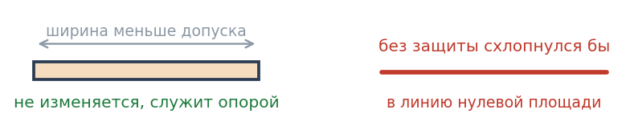
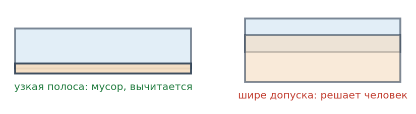
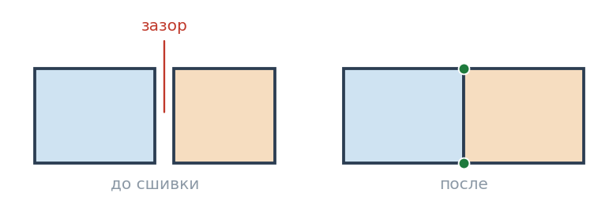
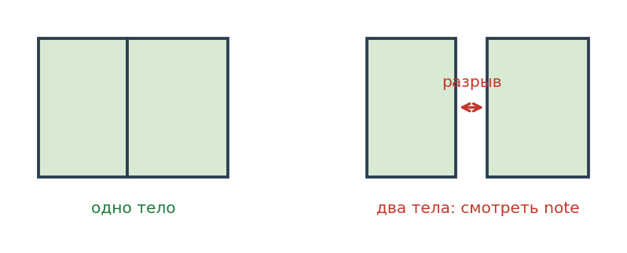
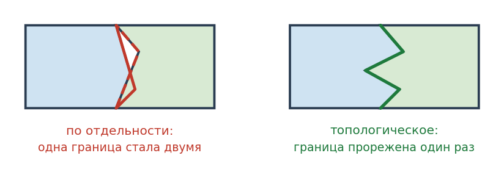
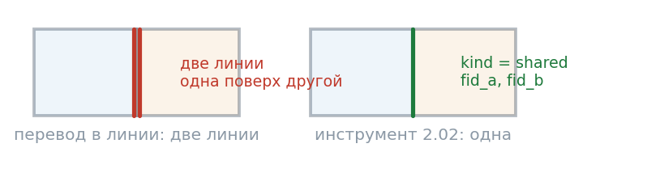

# Topoliner. Краткий мануал

[English version](MANUAL.en.md)

Версия 0.6.0

Плагин добавляет в панель Processing группу **Topoliner** с восемью
инструментами. Основная задача - привести полигональное покрытие в порядок
без ручного снапа слоя к самому себе.

---

## Установка

Меню **Модули - Управление модулями - Установить из ZIP**, выбрать
`topoliner.zip`. Перезапуск QGIS не нужен.

Инструменты появятся в панели **Processing** в группе **Topoliner**,
подгруппа **1. Топология**.

---

## Язык интерфейса

Плагин двуязычный. Язык берётся из локали QGIS, а не системы: если в QGIS
выставлен английский, интерфейс плагина тоже будет английским. Переведены
названия, параметры, справки, отчёты и названия нарушений.

## Инструменты

Номер инструмента задаёт и группу, и порядок в панели Processing.
Ниже каждый инструмент описан отдельно, вместе с таблицей его параметров.


группа **1. Топология** содержит 1.01 - 1.07, группа
**2. Генерализация** содержит 2.01 и 2.02. Порядок в первой группе
соответствует рабочему процессу: проверить, почистить, при необходимости
сшить отдельно, проконтролировать сборку.

| Инструмент | Что делает | Меняет слой |
|---|---|---|
| **1.01 Проверка топологии полигонов** | Ищет нарушения, выдаёт слой точек и сводку | Нет |
| **1.02 Проверка топологии линий** | Недоводы, перелёты, висячие концы, псевдоузлы | Нет |
| **1.03 Очистка топологии полигонов** | Чинит всё, что является мусором | Да, в новый слой |
| **1.04 Очистка топологии линий** | Обрезает перелёты, дотягивает недоводы, вставляет узлы | Да, в новый слой |
| **1.05 Сшивка узлов и вершин** | Только согласование узлов и вершин | Да, в новый слой |
| **1.06 Вставка недостающих узлов** | Достраивает узлы, не меняя ни формы, ни площади | Да, в новый слой |
| **1.07 Контроль сборки по атрибуту** | Проверяет, собираются ли группы в целое тело. Полигоны и линии | Нет |
| **2.01 Топологическое упрощение** | Прореживает вершины полигонов и линий, не разрывая общих границ | Да, в новый слой |
| **2.02 Границы полигонов линиями** | Выдаёт границы отдельными линиями, каждую по разу | Нет |

Все инструменты работают в моделях и в пакетном режиме. Исходный слой
не изменяется никогда, результат всегда новый слой.

---

## Быстрый старт

### Полигональное покрытие

Четыре шага, порядок именно такой.

**Шаг 1. Проверить.** Запустить **1.01 Проверка топологии полигонов** с допуском 2
и порогом площади 1. Посмотреть сводку в панели Processing. Она отвечает
на главный вопрос: сколько нарушений уйдёт молча и сколько придётся смотреть
руками.

**Шаг 2. Почистить.** Запустить **1.03 Очистка топологии полигонов** с теми же
порогами. Прочитать отчёт, особенно строку изменения площади.

**Шаг 3. Проверить снова.** Повторить шаг 1 по результату. В разряде **auto**
должно остаться пусто. Всё, что осталось в разряде **review**, разбирается руками.

**Шаг 4. Проверить сборку.** Запустить **1.07 Контроль сборки по атрибуту** по полю
блока, затем по полю панели. Это конечный критерий приёмки: ради корректной
сборки всё и делается.

### Линейный слой

**Шаг 1.** **1.02 Проверка топологии линий** с допуском 2. Смотреть, сколько
недоводов и перелётов против висячих концов: первые два чинятся, третье
остаётся вам.

**Шаг 2.** **1.04 Очистка топологии линий** с тем же допуском.

**Шаг 3.** Повторить шаг 1. Должны остаться только висячие концы.

**Шаг 4.** При необходимости **1.07 Контроль сборки по атрибуту**: собирается ли
группа линий в одну связную цепь.

---

## Два порога

Всё поведение задаётся двумя числами.

**Допуск** в единицах CRS слоя. Предельное смещение вершины и радиус поиска
соседних рёбер. Берите чуть больше реальной величины расхождений и заметно
меньше длины самого короткого осмысленного ребра. Для оцифровки по планшетам
обычно 1 - 2 м.

**Перекрытия оцениваются шириной, а не площадью.** Полоса шириной с допуск
и длиной в десятки метров набирает сотню квадратных единиц, но остаётся
следствием смещения вершин. Мусором считается перекрытие уже допуска,
содержательным - шире допуска.

**Порог площади** в квадратных единицах CRS. Площадь, ниже которой фрагмент
считается техническим мусором. Разумная точка отсчёта - квадрат допуска.
При допуске 2 м это 4 кв. м, на практике часто хватает 1 кв. м.

**Главное правило для допуска: он должен быть меньше ширины самого узкого
объекта.**


 Если объект уже допуска, его противоположные берега слипнутся,
и он схлопнется сам в себя. Именно так ломаются узкие полосы, например
полигоны между близкими уровнями изолиний.

Инструмент сшивки печатает минимальную и медианную ширину колец до расчёта
и сообщает, сколько колец уже допуска. Смотрите на эту строку перед тем,
как принимать результат.

Уменьшать допуск до ширины самого узкого объекта обычно не нужно и вредно:
такой допуск перестанет смыкать реальные расхождения. Вместо этого работает
флажок **Не изменять объекты уже допуска**, включённый по умолчанию. Узкие
объекты остаются нетронутыми и служат опорой, к которой подтягиваются соседи.

Пороги проводят границу между «мусор, чиню молча» и «смысл, показываю».
Если сомневаетесь, начинайте с малых значений: занизить порог безопасно,
завысить нет.

---

## 1.01 Проверка топологии полигонов


**Вход.** Полигональный слой. Можно ограничиться выделенными объектами.

**Выход.** Слой точек с полями:

- `type` - код нарушения,
- `label` - название по-русски,
- `severity` - `auto` или `review`,
- `fid_a`, `fid_b` - идентификаторы объектов, для парных нарушений оба,
- `value` - величина нарушения (площадь, смещение, количество),
- `note` - пояснение.

**Два похожих нарушения стоит различать.** «Вершина лежит на ребре соседа»
означает расстояние ноль: границы совпадают геометрически, но вершинность
у соседей разная. Такое чинят при любом допуске. «Вершина рядом с ребром»
означает лишь близость, и число таких находок задаётся допуском. Если в сводке
медиана близка к допуску, а не к нулю, вы смотрите на соседние объекты,
а не на дефекты.

**Как читать.** Стилизуйте слой по полю `severity`. Точки `review` - это
рабочий список. Точки `auto` смотреть не обязательно, их уберёт очистка.

Если в `review` много перекрытий, отсортируйте находки по полю `value`
и посмотрите распределение. Провал в распределении и есть искомый порог
площади для этих данных.

**Поле группировки.** Один слой может хранить несколько покрытий, различаемых
атрибутом: зоны разных пластов, варианты раскройки, слои разных лет. Такие
объекты лежат в одних и тех же местах по замыслу, и без группировки каждое
наложение попадает в перекрытия, дубликаты и вложения. Укажите поле, и проверка
пойдёт внутри каждой группы отдельно. Ключ группы записывается в поле `grp`.

На слое геомеханических зон из 379 объектов проверка целиком дала 166 находок,
а с группировкой по пласту 41. Разница целиком приходится на межпластовые
наложения.

Тот же параметр есть у очистки: объекты разных групп не сшиваются между собой
и не спорят за площадь.

**Порог площади полости.** Целик, озеро или незакартированный участок это
часть замысла, а не дефект. Полость крупнее указанной площади находкой
не считается. Мелкая дыра в покрытии остаётся дефектом. Ноль отключает проверку.

**Отключаемые проверки.** Поиск перекрытий и поиск щелей самые дорогие.
На больших слоях их можно выключить и прогнать отдельно.

**Параметры**


| Параметр | Умолчание | Что задаёт |
|---|---|---|
| Проверяемый слой (полигоны) | - | Слой не изменяется |
| Допуск (в единицах CRS слоя) | 2 | Расстояние, ниже которого расхождение считается погрешностью оцифровки |
| Порог площади мусора (кв. единицы CRS) | 1 | Площадь, ниже которой фрагмент считается техническим мусором |
| Поле или поля группировки, *необязательный* | - | Нарушения ищутся внутри каждой группы отдельно. Нужно, когда в слое несколько покрытий |
| Полость крупнее этой площади щелью не считается | 0 | Целик, озеро, незакартированный участок. Ноль отключает |
| Искать перекрытия, дубликаты и вложения | да | |
| Искать щели в покрытии | да | |
| Искать вершины без узла на соседнем ребре | да | |
| Находки | - | Выходной слой точек |

---

## 1.02 Проверка топологии линий


Слой не изменяется. На выходе слой точек с находками и сводка в панели
Processing.

У линий свой набор нарушений. Щели, перекрытия, вложения и волосяные полигоны
к ним не применимы, зато появляются недоводы, перелёты, висячие концы
и псевдоузлы.

**Три случая на конце линии стоит различать.** *Недовод* это конец, не дошедший
до соседней линии: расстояние меньше допуска, это след оцифровки. *Перелёт*
это хвост, торчащий за пересечением, тоже след оцифровки. *Висячий конец*
это конец, которому не с чем соединяться: у гидросети или сети выработок он
обычно является устьем или тупиком, поэтому решение остаётся человеку.

Порядок проверки существенен: у хвоста за узлом конец тоже отстоит от соседней
линии, поэтому перелёт ищется раньше недовода.

**Псевдоузел** это стык двух линий концами, где больше ничего нет. По умолчанию
проверка выключена: во многих слоях разбиение на участки сделано намеренно.

**Параметры**


| Параметр | Умолчание | Что задаёт |
|---|---|---|
| Проверяемый слой (линии) | - | Слой не изменяется |
| Допуск (в единицах CRS слоя) | 2 | Недовод и перелёт короче допуска относятся к мусору |
| Порог длины линии | 0 | Линии короче попадают в находки. Ноль отключает |
| Искать висячие концы, недоводы и перелёты | да | |
| Искать пересечения без узла | да | |
| Искать псевдоузлы | нет | Выключено намеренно: во многих слоях разбиение на участки сделано специально |
| Находки | - | Выходной слой точек |

---

## 1.03 Очистка топологии полигонов




**Что чинится молча**

- повторяющиеся вершины и нулевые сегменты,
- иглы (разворот линии назад в одной вершине),
- вершины, лежащие на ребре соседа без узла,
- перехлёсты рёбер без общих вершин,
- расхождения вершин меньше допуска,
- микродыры и микрочасти,
- некорректная геометрия,
- перекрытия мельче порога площади,
- щели мельче порога площади.

**Что не делается никогда**

- крупные перекрытия,
- крупные щели,
- дубликаты объектов,
- вложенные объекты,
- волосяные полигоны,
- удаление микрообъектов без явного разрешения.

Всё это попадает в слой **Оставшиеся проблемы** с пояснением в поле `note`.

**Порядок шагов.** Чистка вершин, затем микрочасти и микродыры, затем сшивка,
затем исправление некорректной геометрии, затем перекрытия, затем щели.
Порядок зафиксирован и не настраивается: иглы до сшивки, иначе они превращаются
в ложные узлы и разносятся по соседям, а проверка корректности после сшивки,
потому что сшивка сама способна породить самопересечение.

**Основные параметры**

- **При перекрытии площадь сохраняет** - более крупный объект или объект
  с меньшим идентификатором. По умолчанию крупный.
- **Удалять объекты мельче порога площади** - по умолчанию выключено,
  потому что удаление объекта уничтожает и его атрибуты.
- **Порог угла иглы** - около одного градуса убирает только явные артефакты.
- **Восстанавливать отметки Z** - см. раздел «Отметки Z».

**Гарантии**

- Вершина не смещается дальше допуска.
- Правка, отнимающая у объекта больше четверти площади, отменяется. Объект
  остаётся как был и попадает в оставшиеся проблемы.
- Повторный запуск по результату ничего не меняет.
- Атрибуты сохраняются полностью.

**Выходной слой** всегда составного типа, потому что исправление может разделить
объект на несколько частей.

**Параметры**


| Параметр | Умолчание | Что задаёт |
|---|---|---|
| Входной слой (полигоны) | - | |
| Допуск (в единицах CRS слоя) | 2 | Предельное смещение вершины |
| Порог площади мусора (кв. единицы CRS) | 1 | Граница между мусором и возможным смыслом |
| Поле или поля группировки, *необязательный* | - | Объекты разных групп не сшиваются и не спорят за площадь |
| При перекрытии площадь сохраняет | более крупный объект | Второй вариант: объект с меньшим идентификатором |
| Удалять объекты мельче порога площади | нет | Выключено: удаление уничтожает и атрибуты |
| Полость крупнее этой площади щелью не считается | 0 | |
| Порог угла иглы, градусы | 1 | Разворот линии назад в пределах этого угла считается иглой |
| Сшивать вершины и узлы | да | |
| Исправлять некорректную геометрию | да | С контролем потери площади |
| Убирать мелкие перекрытия | да | Узкие полосы, шириной меньше допуска |
| Заполнять мелкие щели | да | Щель уходит соседу с самой длинной общей границей |
| Восстанавливать отметки Z | да | По ближайшей исходной вершине |
| Очищенный слой | - | Всегда составного типа |
| Оставшиеся проблемы, *необязательный* | - | Слой точек: то, что решает человек |

---

## 1.04 Очистка топологии линий

Исправляет то, что заведомо является следом оцифровки.

Снимает повторяющиеся вершины и иглы, обрезает перелёты до самой точки
пересечения, дотягивает недоводы на проекцию на соседнюю линию, вставляет
недостающие узлы, удаляет линии нулевой длины.

**Что не делается**: висячие концы не трогаются, линии короче порога не
удаляются без явного разрешения, псевдоузлы не объединяются.

**Гарантия.** Конец линии не смещается дальше допуска. Повторный запуск
по результату ничего не меняет.

**Параметры**


| Параметр | Умолчание | Что задаёт |
|---|---|---|
| Входной слой (линии) | - | |
| Допуск (в единицах CRS слоя) | 2 | Предельное смещение конца линии и предельная длина обрезаемого хвоста |
| Порог длины линии | 0 | |
| Обрезать перелёты за узел | да | Хвост отрезается до самой точки пересечения |
| Дотягивать недоводы до соседней линии | да | Конец переносится на проекцию |
| Вставлять недостающие узлы | да | |
| Удалять линии короче порога длины | нет | Выключено: удаление уничтожает и атрибуты |
| Порог угла иглы, градусы | 1 | |
| Очищенный слой | - | |
| Оставшиеся проблемы, *необязательный* | - | |

---

## 1.05 Сшивка узлов и вершин




Нужна, когда покрытие в остальном в порядке и требуется только согласовать
границы. Не трогает перекрытия и щели.

Полезный приём: сначала прогон в режиме **Только вставка узлов**. Он не двигает
ни одной существующей координаты и показывает реальный объём расхождений
по числу вставленных узлов.

**Эталонный слой.** Отдельный параметр. Его вершины считаются неподвижными
и притягивают входной слой, сам эталон не изменяется и в результат не попадает.
Нужен, когда новый участок пришивается к уже принятой границе.

**Кто кого притягивает.** По порядку объектов в слое либо крупные притягивают
мелкие. По смыслу обычно подходит второе.

**Параметры**


| Параметр | Умолчание | Что задаёт |
|---|---|---|
| Входной слой (полигоны или линии) | - | |
| Допуск (в единицах CRS слоя) | 2 | Предельное смещение вершины |
| Режим | слияние и вставка | Варианты: только вставка узлов, только слияние вершин |
| Эталонный слой, *необязательный* | - | Его вершины неподвижны и притягивают входной слой. Сам не изменяется |
| Кто кого притягивает | крупные притягивают мелкие | Второй вариант: по порядку объектов в слое |
| Отметка Z вставленного узла | интерполировать вдоль ребра | Второй вариант: взять у притянутой вершины |
| Ставить узлы в точках пересечения рёбер | да | |
| Не изменять объекты уже допуска | да | Такой объект схлопнулся бы сам в себя, поэтому остаётся опорой |
| Если сшивка испортила геометрию | исправить, иначе вернуть исходную | Другие варианты: вернуть исходную, оставить как есть |
| Проверять корректность геометрии до и после | да | |
| Сшитый слой | - | |
| Точки правок, *необязательный* | - | Где двигались вершины и вставлялись узлы |

---

## 1.06 Вставка недостающих узлов

Достраивает узлы там, где вершина одного объекта лежит на ребре другого,
но узла там нет. Ничего больше не делает.

**Чем отличается от сшивки.** Сшивка двигает вершины, чтобы сомкнуть
расхождения. Здесь расхождения нет вовсе: границы уже совпадают, различается
только вершинность. Поэтому вставка узлов ничего не двигает, и суммарная
площадь остаётся прежней точно, а не приблизительно. Отчёт печатает площадь
до и после: если строки о равенстве нет, что-то пошло не так.

**Когда нужно.** Отрисовке разная вершинность не мешает и на глаз не видна.
Мешает объединению по атрибуту, оверлеям, генерализации и загрузке в базу
со строгой топологией. Типичный источник это независимое построение полигонов
по разные стороны общей прямой: линии разлома, края маски обрезки.

**Опорный слой** необязателен. Его вершины служат источником узлов для входного
слоя, сам он не изменяется и в результат не попадает. Без него узлы берутся
из самого входного слоя.

**Отчёт разделяет узлы на два вида**: на рёбрах соседей и в пересечениях
рёбер. Первое это недостающие общие вершины, ради которых инструмент
и сделан. Второе означает, что рёбра пересекаются, то есть объекты
накладываются друг на друга. Если таких узлов больше половины, слой
не является единым покрытием, и стоит сперва посмотреть перекрытия
инструментом 1.01. При осмысленном наложении, например разных пластов
в одном слое, галочку об узлах в пересечениях лучше снять.

**Проходов может понадобиться несколько.** Вставленный узел сам иногда ложится
на ребро третьего объекта, поэтому инструмент повторяет проходы, пока узлы
находятся, и печатает их число. На типичном слое кригинга хватает трёх.

**Отклонение от ребра** это не допуск. Расстояние здесь равно нулю, а число
нужно лишь как защита от ложных срабатываний. Умолчание отвечает точности
координат. Задавать метры не следует: инструмент начнёт подтягивать рёбра,
и обещание про площадь перестанет выполняться.

Находит эти места инструмент **1.01**, тип нарушения **вершина лежит на ребре
соседа без узла**.

**Параметры**


| Параметр | Умолчание | Что задаёт |
|---|---|---|
| Входной слой (полигоны или линии) | - | |
| Опорный слой, *необязательный* | - | Источник узлов. Не изменяется и в результат не попадает |
| Допустимое отклонение вершины от ребра | 0.000001 | Не допуск, а защита от ложных срабатываний. Метры задавать не следует |
| Ставить узлы в точках пересечения рёбер | да | |
| Предельное число проходов | 10 | На согласованном покрытии хватает двух-трёх. Достижение предела означает, что слой не является покрытием |
| Слой с узлами | - | |
| Вставленные узлы, *необязательный* | - | Точки, где появились узлы |

---

## 1.07 Контроль сборки по атрибуту




Проверяет, что объединение объектов с одинаковым значением атрибута даёт ровно
одну часть без внутренних колец. Слой не изменяется.

**Зачем.** Это прямая замена ручной процедуры «объединить без атрибутов
и посмотреть глазами». Инструмент отвечает на конечный вопрос сразу и по всем
группам, а не по одной.

**Что находится**

- **Группа распалась на части.** Внутри группы остался разрыв. В поле `note`
  указано расстояние до ближайшей части. Это и есть допуск, которого не хватило.
- **Внутреннее кольцо в группе.** Внутри группы осталась дыра. Настоящие
  технологические полости тоже попадут сюда, их отличают по площади.

**Важное свойство.** Проверка находит то, чего не видит поиск щелей по всему
покрытию. Зазор, выходящий на внешний край, дырой в объединении не является,
но при сборке группы он разрезает её надвое. Поэтому контроль сборки надо
выполнять всегда, а не только при подозрениях.

**Для линий** вопрос тот же: собирается ли группа в одну связную цепь.
Смежные участки склеиваются, поэтому число исходных отрезков роли не играет.
Внутренних колец у линий не бывает, мерой служит длина.

**Когда группа не обязана быть цельной.** Одно значение атрибута часто описывает
несколько разнесённых тел: полигоны изолиний одного уровня, участки одного типа,
острова. Для таких данных задайте **Максимальный разрыв**. Части, отстоящие
дальше него, считаются отдельными телами, а разрывом остаётся только
разделение внутри тела. Полости в таких данных тоже обычно входят в замысел, для них есть
флажок **Внутренние кольца допустимы**.

Признак того, что порог нужен, виден сразу: если в поле `note` стоят сотни
и тысячи метров, это не дефекты сборки, а нормально разнесённые тела. Для зон,
блоков и панелей порог оставляют нулевым: там группа обязана собираться в одно
целое.

Если выбрано несколько полей, ключом становится их сочетание.

**Параметры**


| Параметр | Умолчание | Что задаёт |
|---|---|---|
| Слой (полигоны или линии) | - | Слой не изменяется |
| Поле или поля группировки | - | Обязательный. При нескольких полях ключом становится их сочетание |
| Порог площади мусора | 1 | Ниже этой площади внутреннее кольцо считается мусором |
| Максимальный разрыв внутри тела | 0 | Насколько далеко части ещё считаются одним телом. Ноль означает, что группа обязана быть цельной |
| Внутренние кольца допустимы | нет | Для данных, где полость входит в замысел |
| Находки сборки | - | Выходной слой точек |

---

## 2.01 Топологическое упрощение




Прореживает вершины так, что граница, общая для двух соседей, остаётся общей.

**Зачем.** Обычное упрощение обрабатывает каждый полигон отдельно, поэтому одна
и та же граница прореживается дважды и по-разному: появляются щели и перехлёсты.
Замер на слое зон с допуском 5: топологическое упрощение не порождает ни одного
нарушения, независимое даёт 46 перекрытий, 25 щелей и 189 несогласованных узлов.

**Как работает.** Общие рёбра склеиваются в дуги между узлами ветвления, каждая
дуга прореживается ровно один раз, и обоим соседям достаётся один и тот же
результат. Концы дуг неподвижны, поэтому узлы, где сходятся три полигона,
не смещаются.

**Линии** обрабатываются наравне с полигонами. Общий участок двух линий
прореживается один раз, концы линий и точки ветвления остаются на месте.
Это нужно изолиниям, гидросети и горным выработкам: обычное упрощение
разрывает их в узлах.

**Два метода прореживания.** Дуглас-Пекер меряет отклонение вершины от хорды:
держит углы и характерные изломы, но на плавной кривой оставляет заметные
грани. Висвалингам меряет площадь треугольника из трёх соседних вершин:
на плавных линиях результат мягче, зато острый угол из коротких рёбер может
срезаться. Для границ блоков и выработок подходит первый, для изолиний
и гидросети второй.

Допуск в обоих случаях задаётся в единицах длины, одним полем: так проще
в моделях и в пакетном режиме. Точного соответствия между методами нет,
один меряет расстояние, другой площадь: при равном числе в поле Висвалингам
оставляет заметно больше вершин, поэтому для сравнимого результата его допуск
берут крупнее.

**Сглаживание** срезает углы после прореживания, по тем же дугам, поэтому
общая граница остаётся общей. Схема Чайкина не выходит за исходную линию,
так что выбросов и новых самопересечений не возникает. Каждый проход примерно
удваивает число вершин, обычно хватает одного или двух.

**Точность опознания общих вершин** это не допуск упрощения. Она нужна, когда
соседи записаны с разной точностью координат. Задавать метры не следует.

Площадь при упрощении меняется, в этом его смысл. Топология при этом
не портится: проверьте результат инструментом 1.01, число находок не должно
вырасти.

**Параметры**


| Параметр | Умолчание | Что задаёт |
|---|---|---|
| Входной слой (полигоны или линии) | - | |
| Метод прореживания | Дуглас-Пекер | Второй вариант: Висвалингам, по площади треугольника |
| Допуск упрощения | 1 | Предельное отклонение упрощённой линии от исходной. Для Висвалингама пересчитывается в площадь |
| Не упрощать дуги короче, вершин | 0 | Защита коротких участков границы. Ноль отключает |
| Сглаживание, число проходов | 0 | Срезание углов после прореживания. Каждый проход примерно удваивает число вершин |
| Точность опознания общих вершин | 0.000001 | Не допуск упрощения. Нужна, когда соседи записаны с разной точностью координат |
| Поле или поля группировки, *необязательный* | - | Границы разных групп общими не считаются |
| Сохранять отметки Z | да | |
| Упрощённый слой | - | |

---

## 2.02 Границы полигонов линиями




Выдаёт границы покрытия отдельными линиями, от узла до узла. Слой не меняется.

**Чем отличается от перевода полигонов в линии.** Обычный перевод выдаёт общую
границу дважды, по разу от каждого соседа: две совпадающие линии одна поверх
другой. Стиль ложится на обе, и толщина удваивается. Здесь граница выходит
один раз.

**Три вида границ:** между объектами, внешний край покрытия, край полости.
Если в полости лежит другой объект, это уже граница между объектами.

**Атрибуты:** `kind`, `label`, `fid_a`, `fid_b`, `length`. Если задано поле,
добавляются `val_a` и `val_b` - значение поля у каждого соседа. Для
геологических границ это пласт слева и пласт справа.

**Линия рвётся** там, где сходятся три и более объекта, и там, где меняется
пара соседей. Граница между двумя телами выходит одним куском.

**Отклонение при поиске общих вершин.** Если у соседей разная вершинность,
общая граница не опознаётся. Перед разбором такие узлы достраиваются, вершины
при этом не двигаются. Проверить слой заранее можно инструментом 1.01.

**Параметры**


| Параметр | Умолчание | Что задаёт |
|---|---|---|
| Входной слой (полигоны) | - | Слой не изменяется |
| Поле, значения которого записать по обе стороны, *необязательный* | - | Значение поля у каждого соседа попадёт в атрибуты линии |
| Отклонение при поиске общих вершин | 0.000001 | Узлы достраиваются перед разбором, вершины при этом не двигаются. Ноль отключает |
| Точность опознания общих вершин | 0.000001 | |
| Границы | - | Выходной слой линий |

---

## Что решено по общим границам

| Случай | Результат |
|---|---|
| У соседа есть вершина на общей границе, у нас нет | Узел вставляется, координаты не смещаются |
| T-образный стык трёх полигонов | Узел появляется у того, у кого его не было |
| Четыре полигона сходятся в углу с разбросом меньше допуска | Все углы сводятся в одну точку |
| Угол заходит за границу соседа меньше допуска | Вершины сводятся, перехлёст исчезает |
| Рёбра пересекаются крест-накрест без общих вершин | Узлы ставятся в точках пересечения |
| Наклонная граница уже совпадает | Ничего не меняется, ложных узлов нет |
| Нестыковка больше допуска | Не трогается, это содержательный случай |

---

## Отметки Z

При сшивке вершина берёт плановые координаты лидера и оставляет собственную
отметку, поэтому пласты с разными Z не перемешиваются.

В инструменте очистки операции пересечения работают в плане, поэтому Z
восстанавливается по ближайшей исходной вершине. Для покрытий это корректно.
Для слоёв с резкими перепадами отметок вдоль границы результат следует проверить.

---

## Предупреждения в отчёте

**Суммарная площадь изменилась более чем на процент.** Почти всегда означает
завышенный порог площади. Уменьшите его и повторите.

**Вырожденных колец удалено.** Допуск больше размера самих объектов. Уменьшите
допуск.

**Объектов исчезло.** Объект целиком ушёл при исправлении. Найдите его в слое
оставшихся проблем по типу `lost` и разберите вручную.

**Исправлений отменено из-за потери площади.** Сработала защита: правка
некорректной геометрии отнимала больше четверти площади. Объект оставлен
без изменений.

**Некорректных геометрий стало больше.** Допуск слишком велик для этих данных.

---

## Заливка результата обратно в MSSQL

Порядок, проверенный на слое зон.

**1. Бэкап.** Одной строкой в SSMS или в окне SQL менеджера БД:

```sql
SELECT * INTO dbo.Zones_backup_ГГГГММДД FROM dbo.Zones;
```

Правка живой таблицы откатывается только из бэкапа, поэтому шаг обязателен.

**2. Замена через буфер правки.** Открыть целевой слой на редактирование,
выделить все объекты и удалить, затем вставить объекты из очищенного слоя.
Атрибуты сопоставляются по именам полей, поэтому имена менять нельзя.

**3. Проверка до сохранения.** Открыть таблицу атрибутов и убедиться, что ключевое
поле заполнено исходными значениями, а не пустое. Подводный камень ровно один:
если ключ является колонкой IDENTITY, сервер может отказаться принимать явные
значения либо раздать свои, и тогда порвутся внешние связи. Видно это сразу
при сохранении.

**4. Если сервер заругался на IDENTITY.** Откатить правку и идти через временную
таблицу с обновлением по ключу:

```sql
UPDATE z SET z.geom = s.geom.MakeValid()
FROM dbo.Zones z JOIN dbo.Zones_snap s ON z.zone_id = s.zone_id;
```

**5. Контроль на сервере.**

```sql
SELECT COUNT(*) FROM dbo.Zones WHERE geom.STIsValid() = 0;
```

Должен быть ноль.

**Про MakeValid.** SQL Server строже GEOS. Геометрия, корректная в QGIS, может
не пройти на сервере, чаще всего из-за точечных самокасаний колец. Инструмент
очистки предупреждает об этом отдельной строкой в отчёте. Если предупреждение
появилось, применяйте `MakeValid()` на стороне сервера.

---

## Ограничения

**Щели ищутся как дыры в объединении покрытия.** Зазор, выходящий на внешний
край покрытия, дырой не является и этим способом не находится. Такие зазоры
закрывает сшивка вершин, если их ширина меньше допуска.

**Слой читается в память целиком.** Замер на кадастровом слое: 11 872
объекта, 15 700 колец, 742 тысячи вершин. Вставка недостающих узлов проходит
за две-три минуты, проверка топологии трёх тысяч объектов за десяток секунд.
Для слоёв в миллионы вершин обрабатывайте по частям.

**Величина координат влияет на точность.** В системах, где координаты
измеряются миллионами метров, вроде Web Mercator, число двойной точности
разрешает около нанометра. Ребро между вершинами существует как формула,
и знак определителя при проверке стороны вычисляется из разностей больших
чисел, где старшие цифры сокращаются. Отсюда берутся перекрытия площадью
в десятки квадратных микрон: у них нет ширины, только длина. Инструмент
относит их к мусору, потому что оценивает перекрытие шириной. В местной
системе с шестизначными координатами такого шума на порядок меньше.

**Для линий** есть свои проверка 1.02 и очистка 1.04. Кроме них линии
принимают сшивка 1.05, вставка узлов 1.06, контроль сборки 1.07
и упрощение 2.01.

**Автоматика не знает, какая из двух спорящих границ верна.** Она различает
только масштаб: сантиметровый нахлёст является погрешностью, гектарный является
разногласием между источниками. Поэтому крупные перекрытия и щели остаются
человеку всегда.

---

## Справочник полей выходных слоёв

### Слой находок

Выдают инструменты **1.01**, **1.02**, **1.07**, а также очистка в слое
оставшихся проблем. Геометрия точечная: точка стоит там, где найдено
нарушение.

| Поле | Тип | Что содержит |
|---|---|---|
| `type` | строка | Код нарушения: `overlap`, `gap`, `on_edge`, `dangle` и прочие. Удобно фильтровать |
| `label` | строка | То же на языке интерфейса, для чтения человеком |
| `severity` | строка | `auto` - мусор, инструмент очистки исправит сам. `review` - решает человек |
| `fid_a` | целое | Идентификатор объекта. Для парных нарушений - первый из пары |
| `fid_b` | целое | Второй объект пары, либо -1 если нарушение относится к одному объекту |
| `value` | вещественное | Измеренная величина: площадь перекрытия или щели, расстояние до соседней линии, число снятых вершин. Смысл зависит от типа |
| `note` | строка | Пояснение с измеренной величиной: чем этот случай отличается от соседнего того же типа |
| `grp` | строка | Ключ группы, если задано поле группировки |

**Как стилизовать.** Правило по `severity`: `review` красным и крупнее,
`auto` мелким серым. Тогда рабочий список виден сразу.

### Слой точек правок

Выдаёт инструмент **1.05**.

| Поле | Тип | Что содержит |
|---|---|---|
| `kind` | строка | `move` - вершина сдвинута, `insert` - вставлен узел |
| `dist` | вещественное | Величина смещения. Для вставленного узла ноль |
| `ring` | целое | Номер кольца, к которому относится правка |

### Слой вставленных узлов

Выдаёт инструмент **1.06**.

| Поле | Тип | Что содержит |
|---|---|---|
| `kind` | строка | `insert` - узел на ребре, `cross` - узел в точке пересечения рёбер |
| `dist` | вещественное | Отклонение вершины от ребра. Обычно ноль |

### Слой границ

Выдаёт инструмент **2.02**. Геометрия линейная, каждая линия идёт от узла
до узла.

| Поле | Тип | Что содержит |
|---|---|---|
| `kind` | строка | `shared` - граница между двумя объектами, `outer` - внешний край покрытия, `hole` - край полости |
| `label` | строка | То же на языке интерфейса |
| `fid_a` | целое | Идентификатор объекта по одну сторону |
| `fid_b` | целое | По другую сторону. Для внешнего края и края полости -1 |
| `length` | вещественное | Длина участка |
| `val_a` | строка | Значение выбранного поля у первого соседа. Только если поле задано |
| `val_b` | строка | То же у второго соседа. Для внешнего края пусто |

**Как стилизовать.** Правило по `kind`: внешний край толще, границы между
объектами тоньше, край полости пунктиром. Для геологических границ - правило
по паре `val_a` и `val_b`: граница между конкретными пластами получает свой
стиль.

### Очищенный и сшитый слои

Атрибуты исходного слоя сохраняются полностью. Добавленных полей нет.
Геометрия очищенного слоя всегда составного типа: исправление может разделить
объект на несколько частей.

---

## Проверка кода

Геометрическая логика вынесена из QGIS в отдельные модули и покрыта тестами:

```
cd topoliner
python -m unittest discover -s tests -v
```

QGIS для тестов не нужен. Проверки перекрытий и щелей тестируются
на Shapely, который использует тот же GEOS, что и QGIS.
